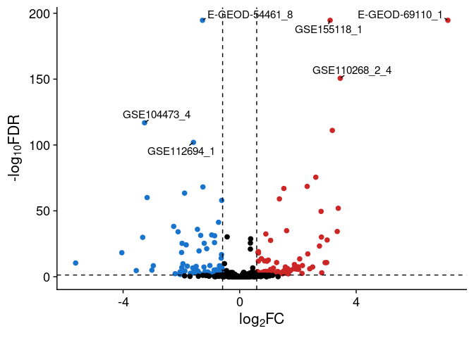

<!-- README.md is generated from README.Rmd. Please edit that file -->

# SkeletalVis

<!-- badges: start -->

[](https://github.com/soulj/SkeletalVis/actions/workflows/R-CMD-check.yaml)
[](https://CRAN.R-project.org/package=SkeletalVis)
<!-- badges: end -->

The goal of SkeletalVis is to enable the search and visualisation of
uniformly processed skeletal transcriptomic datasets. It provides tools
to identify datasets in which genes of interest are differentially
expressed and to discover datasets with similar gene expression profiles
to a given query.

It additional allow exploration of the OATargets database and
prioritised genes for causing an osteoarthritis damage phenotype in
animal models.

## Installation

You can install the release version of SkeletalVis from CRAN:

    install.packages("SkeletalVis")

You can install the development version of SkeletalVis from
[GitHub](https://github.com/soulj/SkeletalVis) with:

``` r
# install.packages("pak")
pak::pak("soulj/SkeletalVis")
```

## Example

This is a basic example which shows how to search for a gene of interest
across the SkeletalVis data. See the vignette for a full tutorial of
SkeletalVis.

``` r
# Load the library
library(SkeletalVis)

# Set up the database
skeletalvis <- load_skeletalvis()
#> All files are already present

# Get the differential expression of the gene SOX9 across the database
gene_results <- get_gene_fold_changes(skeletalvis, "SOX9", return_fdr = TRUE)
head(gene_results)
#> # A tibble: 6 × 15
#>   datasetID log2FoldChange       FDR Gene  accession comparisonsText Description
#>   <chr>              <dbl>     <dbl> <chr> <chr>     <chr>           <chr>      
#> 1 E-GEOD-6…           7.15 0         SOX9  E-GEOD-6… SOX9vseGFP      "SOX9 over…
#> 2 GSE15511…           3.11 0         SOX9  GSE155118 Sox5_6_9_OEvsc… "Primary c…
#> 3 E-GEOD-5…          -1.28 2.25e-195 SOX9  E-GEOD-5… Day18vsDay2     "Temporal …
#> 4 GSE11026…           3.47 1.37e-132 SOX9  GSE11026… YAP KO_MSCvsWT… "YAP1 and …
#> 5 GSE12103…           1.99 3.92e-128 SOX9  GSE121033 Lentiviruses e… "Polycomb …
#> 6 GSE12516…           3.18 8.58e-112 SOX9  GSE125167 PLZF_10_days_d… "PLZF knoc…
#> # ℹ 8 more variables: PMID <chr>, Species <chr>, Tissue <chr>, ExpType <chr>,
#> #   Perturbation <chr>, Effect <chr>, Type <chr>, platform <chr>
```

There are also several built in plotting functions:

``` r
# Plot the log2fold change against the FDR for SOX9 across the datasets
volcano_plot(gene_results, number_points = 3)
```


